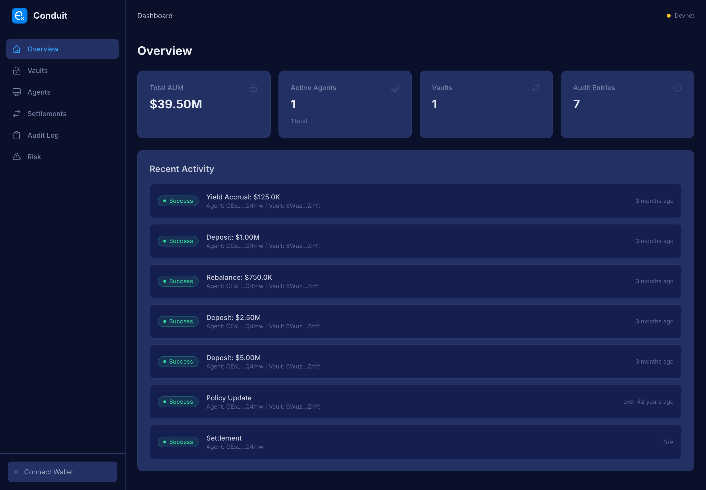
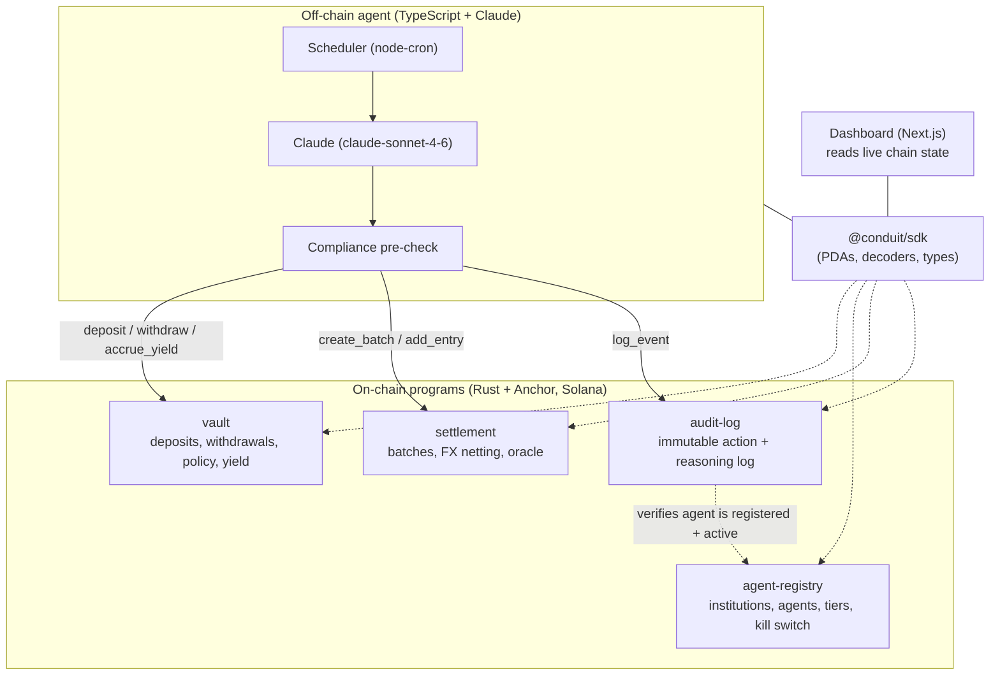
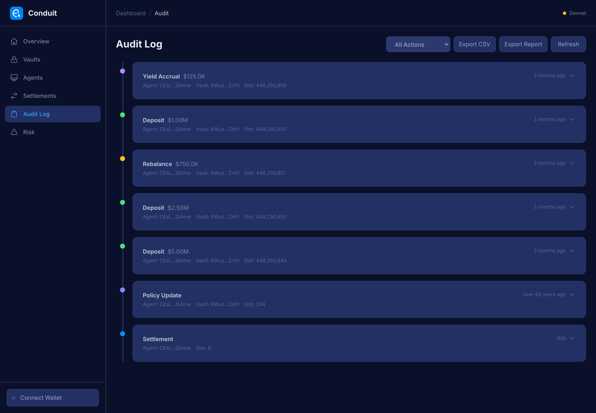
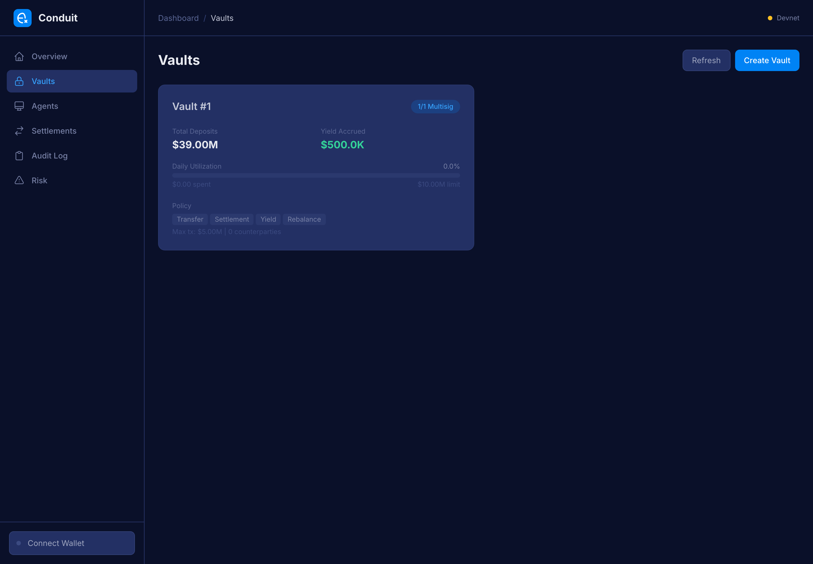
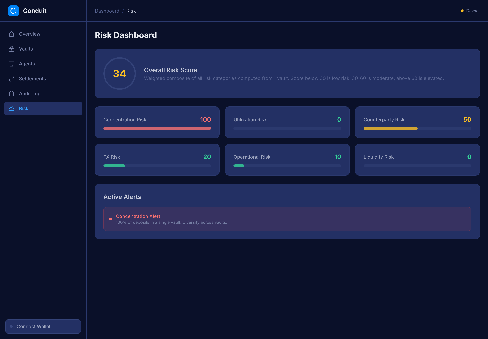

# Conduit

**An AI agent that autonomously manages institutional treasuries on Solana, with every decision policy-checked on-chain and logged to an immutable, replayable audit trail.**

Conduit is a working end-to-end system: four on-chain Anchor programs enforce the rules, an autonomous off-chain agent makes the decisions (using Claude), a TypeScript SDK ties them together, and a live dashboard reads it all straight off the chain.

> **What this proves:** I can design and ship a complete AI-agent-plus-onchain system, not just a contract or a script. On-chain authority and policy enforcement, an autonomous agent with a real decision loop, a typed SDK, a production dashboard reading live chain state, and a verifiable audit trail that ties an agent's reasoning to the transaction it produced.

**Live demo:** https://conduit-one-gamma.vercel.app (Solana devnet, seeded with demo data)



---

## The idea

A treasury desk wants to let software move real money: rebalance idle stablecoin reserves into yield, net cross-border settlements, stay inside policy. Letting an autonomous agent do that is only acceptable if the chain itself enforces the guardrails and every action is auditable after the fact.

Conduit splits the problem cleanly:

- **The chain is the source of authority.** Spend limits, multisig thresholds, approved counterparties, allowed transaction types, and agent permissions all live in on-chain accounts. The agent cannot exceed them because the programs reject the transaction.
- **The agent is the decision-maker.** It observes vault state and market conditions, asks Claude what to do, runs the proposed action past a compliance check, executes it, and writes its reasoning to the chain.
- **The audit log is the receipt.** Every action is recorded with a hash of the agent's reasoning (and an optional IPFS pointer to the full text), cross-validated against the agent registry, and stamped with the Solana slot and time. You can replay exactly why the agent did what it did.

---

## Architecture



### The agent loop

Three independent schedules run on cron (cadences are configurable):

| Cadence (default) | Job | What happens |
| --- | --- | --- |
| every 15 min | **Rebalance** | Read vault positions + market snapshot, ask Claude whether to rebalance into yield, run the compliance check, execute the deposit/withdraw, log it on-chain. |
| every 4 hours | **Settlement** | Gather pending cross-border payments, ask Claude how to batch and net them, create the settlement batch and entries on-chain, log it. |
| every 5 min | **Compliance scan** | Read-only sweep of all vaults for limit breaches and low reserves. Runs at every tier. |

Each acting job follows the same chain of custody: **observe -> Claude decides -> compliance gate -> execute on-chain -> hash the reasoning -> write the audit entry.** The agent's authority tier (Observer / Executor / Manager / Admin) gates which jobs it is allowed to run, and that tier is enforced from its on-chain registry record.

---

## The four programs

All four are deployed and live on **Solana devnet**.

| Program | Program ID (devnet) | Responsibility |
| --- | --- | --- |
| **vault** | `Ctd8BHaHPD7QUjk18SeRkaadpkR5dDF2opq4Cn6vGPii` | Holds USX (a USD-stable token). Enforces per-transaction and daily spend limits, approved counterparties, allowed transaction types, m-of-n multisig on policy changes, KYC-gated deposits, and yield accrual. |
| **agent-registry** | `D6ixuieTocq25Rf2Ru4qAAuxSPx5mbR6UABjY7PoNDnh` | Registers institutions and their agents. Assigns each agent an authority tier (0-3) and a set of scoped programs. Includes activate / deactivate (kill switch) controls, admin-gated. |
| **settlement** | `DQj9jfTNEaMCrUD8DfAiRkcmMiragBYv33Qh27ZiZuYU` | Batches multi-vault settlement instructions, computes per-entry net offsets against an on-chain FX rate oracle, and executes the netted transfer. Batches move through an Open -> Processing -> Settled lifecycle. |
| **audit-log** | `9kDA9TbKmTMdSEpM4ZpYTYAmniuETRVL3uWWrS6CQ7ZG` | Append-only log of every agent action. Each entry records the action type, target vault, amount, a SHA-256 hash of the agent's reasoning, an optional IPFS URI, and the slot + timestamp. Cross-validates that the acting agent is registered and active in `agent-registry` before writing. |

**Program instruction surface (what is actually implemented):**

- `vault`: `initialize_vault`, `deposit`, `withdraw`, `update_policy`, `accrue_yield`
- `agent-registry`: `register_institution`, `register_agent`, `update_agent_tier`, `deactivate_agent`, `reactivate_agent`
- `settlement`: `initialize_config`, `create_batch`, `add_entry`, `execute_settlement`, `update_fx_rate`
- `audit-log`: `log_event`

The cross-program design is deliberate: `settlement` validates that the vaults it touches are owned by the `vault` program, and `audit-log` reads the agent's PDA from `agent-registry` and checks ownership + active status before it will record an action. The agent literally cannot log an action it was not authorized to take.

---

## What it looks like

**Audit log: every agent action with its on-chain reasoning trail.**



**Vault detail: balances, policy, limits, multisig.**



**Risk dashboard: a weighted composite computed from live vault state.**



---

## Tech stack

| Layer | Stack |
| --- | --- |
| On-chain | Rust, Anchor 0.31.1, Solana, SPL Token |
| Agent | TypeScript, Anthropic SDK (`claude-sonnet-4-6`), node-cron, pino, optional Pinata/IPFS |
| SDK | TypeScript, hand-written Borsh decoders, PDA derivation, full account types |
| Dashboard | Next.js 15, React 19, Tailwind CSS, Recharts, Solana wallet-adapter |
| Tooling | pnpm + Turborepo monorepo, Playwright (dashboard e2e), Docker (localnet + agent) |

### Repository layout

```
programs/        4 Anchor programs (vault, agent-registry, settlement, audit-log)
agent/           autonomous agent: core loop, chain I/O, AI, services, logging, storage
sdk/             @conduit/sdk: PDAs, account decoders, constants, types
dashboard/       Next.js dashboard that reads live on-chain state
tests/           Anchor/mocha integration tests (one suite per program)
docker/          localnet validator + agent compose setup
```

---

## Run it

### Prerequisites

- Node 20+ and `pnpm`
- Rust + the Solana CLI + Anchor (`avm install 0.31.1`) for building/deploying the programs
- An `ANTHROPIC_API_KEY` if you want the agent to make real decisions

```bash
pnpm install
cp .env.example .env   # fill in ANTHROPIC_API_KEY (+ optional PINATA_JWT)
```

### Dashboard against the live devnet deployment

The fastest way to see it working. The dashboard reads the deployed programs directly.

```bash
cd dashboard
NEXT_PUBLIC_SOLANA_NETWORK=devnet \
NEXT_PUBLIC_SOLANA_RPC_URL=https://api.devnet.solana.com \
pnpm dev
# open http://localhost:3000/dashboard
```

### Full local stack

```bash
# build + test the programs against a local validator
anchor build
anchor test

# or bring up a localnet validator + the agent via Docker
docker compose -f docker/docker-compose.yml up

# seed demo data (institution, agent, vault, settlement, audit entries)
cd agent && pnpm seed

# run the agent
cd agent && pnpm dev
```

---

## Verification

This was built and checked end-to-end, not just rendered.

**Verified:**

- All four programs are **deployed and executable on Solana devnet** (confirmed against the public RPC), seeded with demo data: 1 vault, 1 institution + 1 agent, 1 settlement batch (+ entries), 7 audit entries.
- The **SDK builds** (`tsc`) and its decoders correctly deserialize the live on-chain accounts.
- The **dashboard builds** (`next build`, 10 routes), typechecks clean, and renders live devnet data across the overview, vaults, agents, settlements, audit, and risk pages (the screenshots above are the live deployment).
- A real bug was found and fixed during verification: each dashboard hook fetched **all** account types owned by a program and decoded them as a single type, corrupting reads (and crashing the overview/vaults pages on real data). Reads are now filtered by Anchor account discriminator. Verified against live devnet: vault 14 accounts -> 1 decoded / 13 correctly skipped, settlement 5 -> 1 / 4, agents 2 -> 1 / 1, audit 7 -> 7, zero decode errors.

**Inferred / environment-noted:**

- The agent's market data is mocked for the devnet demo (the integration point for real price/yield feeds is isolated in `agent/src/services/market.ts`).
- On the machine used here, a local `anchor build` is blocked by a platform-tools `edition2024` toolchain mismatch; the on-chain deployment above is the proof the programs build. The Anchor + mocha test suites live in `tests/`.

---

## License

MIT
